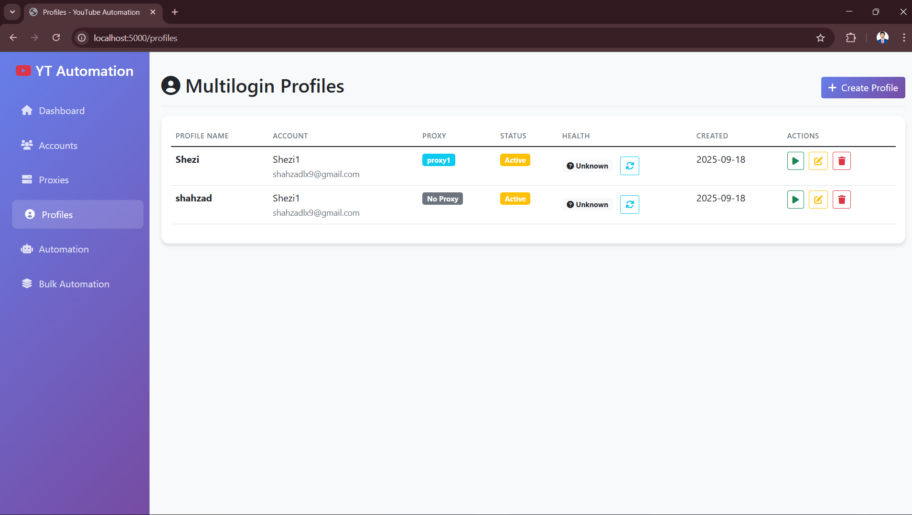

<meta name="google-site-verification" content="31CiKXunw9dv9uS3olptabrNlRe4jZv4ifHOwiwvfhg" />

# YouTube View Bot — Advanced Automation & Engagement System

**A scalable YouTube view bot that simulates real human behavior while managing multiple accounts at massive scale.**  
Boost views, likes, subscriptions, and comments safely using real-browser automation, proxy rotation, and engagement ratio control.

<p align="center">
  
</p>

<p align="center">
  <a href="https://discord.gg/vBu9huKBvy">
    
  </a>
  <a href="https://t.me/devpilot1">
    
  </a>
</p>

---

## Overview
This **YouTube View Bot** is a production-ready automation system designed for **creators, agencies, SMM panels, and growth marketers**.  
It automates **views, likes, comments, and subscriptions** across 10–1,000+ accounts while mimicking real human behavior to avoid detection and preserve account trust.

 - Search-based view attribution  
 - Likes, comments, subs automation  
 - Random act system (Shorts, Trending, Sidebar, Keywords)  
 - Playback controls (duration, quality, speed)  
 - Proxy + fingerprint handling via 
 - Engagement ratio control  
 - Central dashboard with logs and analytics

---

## Key Features
| # | Feature | Description |
|--|--|--|
| 1 | View automation | Watch videos via keyword search, direct URLs, playlists, or channels |
| 2 | Engagement actions | Automate likes, comments, and subscriptions with custom ratios |
| 3 | Human-like simulation | Randomized scrolls, delays, clicks, playback speed, and quality |
| 4 | Random act engine | Simulates Shorts, Trending tab, Sidebar, and keyword exploration |
| 5 | Proxy + fingerprints | One proxy per account with browser containers in Multilogin |
| 6 | Multi-account scaling | Supports 10–1,000+ accounts with isolated sessions |
| 7 | Dashboard control | Manage accounts, proxies, schedules, logs, and performance |
| 8 | Analytics & logs | Real-time reports, session logs, and error screenshots |
| 9 | Built-in retries | Automatic backoff, error recovery, and session reuse

---

#Architecture
<p align="center">
  
</p>

## Performance
- Runs 1–1,000+ accounts  
- Human-like dwell behavior with randomized delays  
- Less than 1% block rate using aged accounts and quality proxies

---

## Dashboard Overview

<p align="center">
  
</p>


## Accounts

<p align="center">
  
</p>

## Proxies 

<p align="center">
  
</p>

## Profiles

<p align="center">
  
</p>

## Automation

<p align="center">
  
</p>

## Bulk Automation

<p align="center">
  
</p>

## Requirements
- Google Accounts (start with 10)  
- Residential or Mobile Proxies   
- PC or VPS for deployment


---

## Installation
```bash
# Clone the repository
cd youtube-view-bot

# Cookies managment 
Copy and paste your cookies in youtube_cookies.json

> you can use easy cookies manager extention to get the cookies Easily

# Install dependencies
pip install -r requirements.txt

# Setup environment
cp .env.example .env

# Start backend + dashboard
python youtube_script.py
```
This is simple version, To get Scalable automation system with centerlized Dashboard Contact Us. 

## Contact

- [Join Discord](https://discord.gg/vBu9huKBvy)  
- [Message on Telegram](https://t.me/devpilot1)


